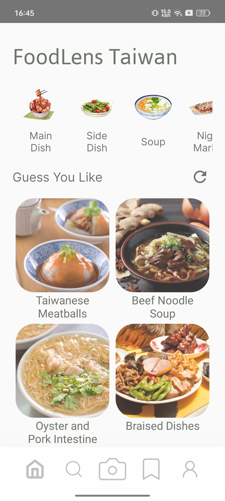
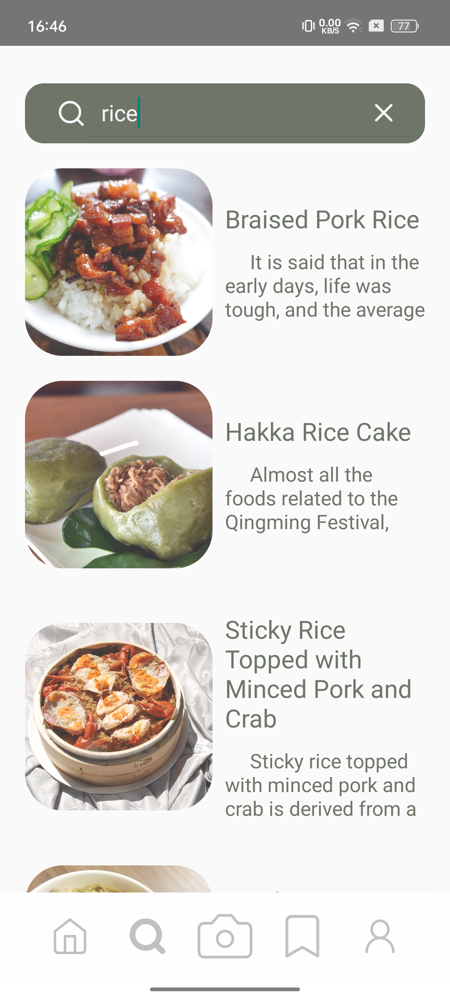
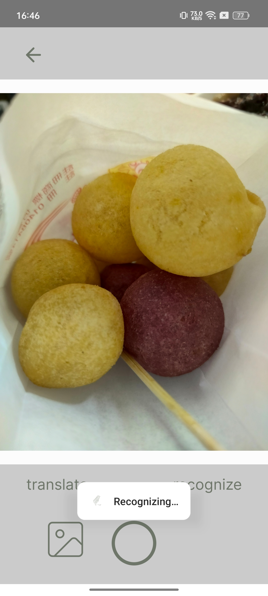
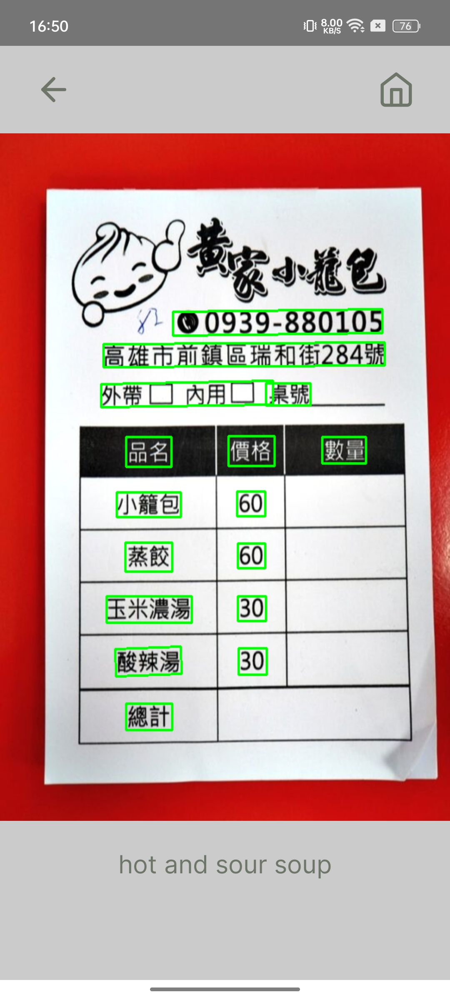
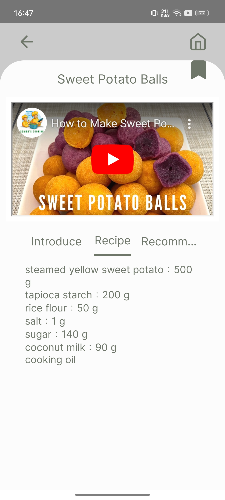
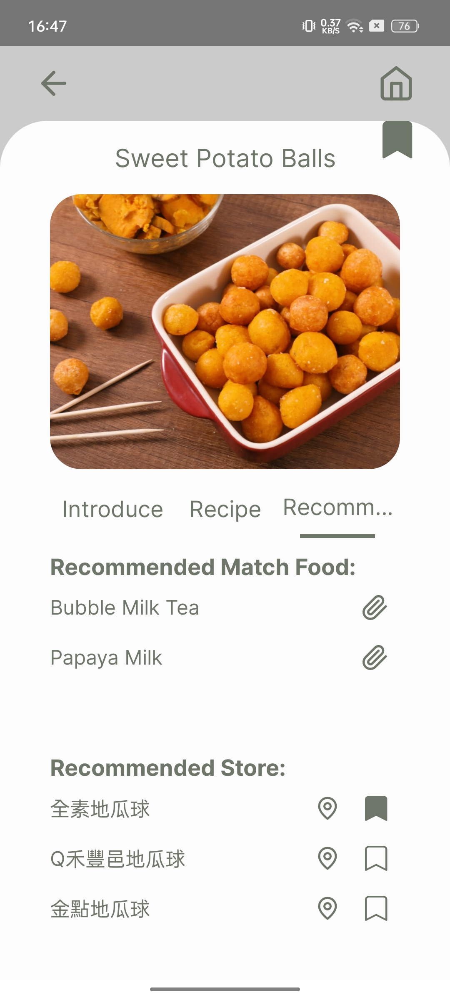
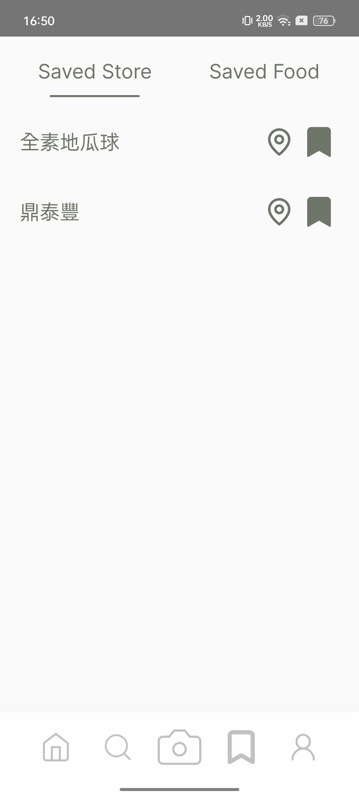
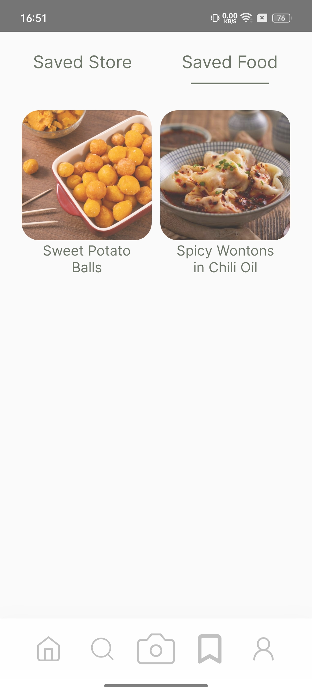
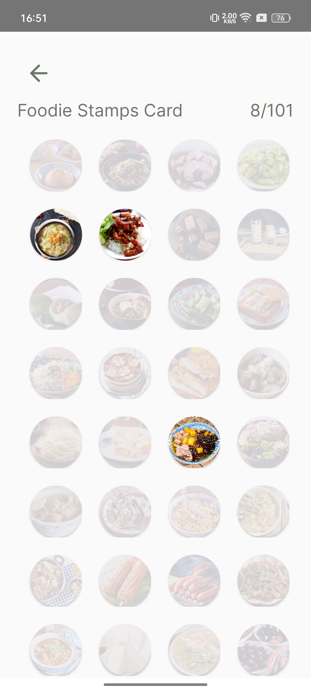

# 🥢FoodLens Taiwan - 探索台灣美食的影像辨識應用程式
讓旅客輕鬆探索台灣美食文化！

## 📌 專案介紹
FoodLens Taiwan 是一款基於 AI 的美食導遊 App，幫助來台旅客解決語言障礙，快速找到當地美食並深入了解台灣的美食文化。

## 🎯 功能特色
1. AI 食物辨識 - 透過 AI 辨識食物，提供文化背景、食譜及推薦店家資訊
2. OCR 菜單翻譯 - 透過 OCR 技術翻譯菜單，解決語言障礙
3. 關鍵字搜尋 - 根據食物名稱快速搜尋相關資訊
4. 收藏功能 - 讓使用者收藏喜愛的美食與店家
5. 辨識紀錄 - 以集點卡方式呈現食物辨識歷史

## 🛠 開發工具
1. 前端：Figma、DhiWise
2. App 開發：Android Studio
3. 資料庫：SQLite
4. AI 模型：DenseNet121（食物辨識）、Paddle OCR（圖片文字辨識）
5. 翻譯 API：Google Cloud Translation API

## 📸 使用示例
## 📸 使用示例 (Usage Examples)

| **首頁** | **搜尋功能** | **食物辨識** |
|---------|------------|--------------|
|  |  |  |

| **菜單翻譯** | **食譜** | **推薦店家** |
|-------------|--------|--------------|
|  |  |  |

| **收藏店家** | **收藏美食** | **美食集點卡** |
|-------------|------------|----------------|
|  |  |  |

